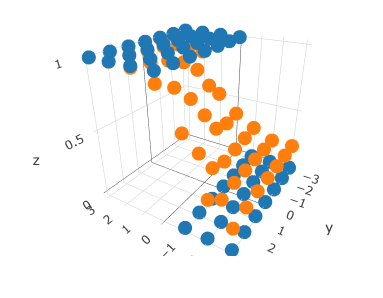
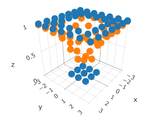
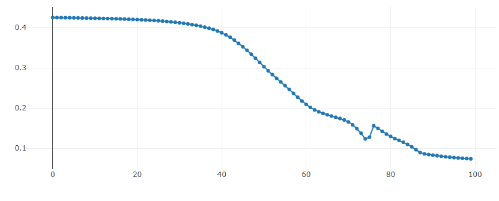

# micrograd.rs

A tiny autograd engine for learning purposes in Rust.







## Example usage

```rust
let v1 = Value::from(2.0);
let v2 = Value::from(3.0);
let v3 = &v1 + &v2;
let v4 = &v3 * &v1;
let v5 = &v4.pow(2);
v5.back_prop();

assert_eq!(v5.value(), 100.0);
assert_eq!(v1.grad(), 140.0);
assert_eq!(v2.grad(), 40.0);
```

## TODO ✨

- [x] Create `Value` struct with computational graph
- [x] Test on some test data
- [ ] Implement graphing of computational graph
- 